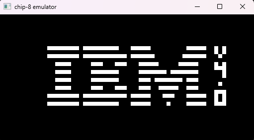
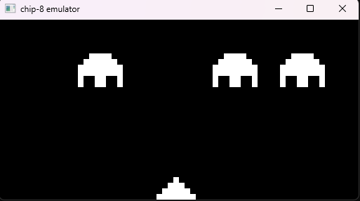

### This project is an emulator of the chip-8 language.
To compile, you need the SFML library, CMake, and any other C++ compiler. Before compiling, you must specify the path to your SFML library in the file "src/CMakeLists.txt".
The variable MY_SFML_PATH must be written: "{path_to_SFML}/lib/cmake/SFML".
After that, you can compile the project using the commands:
```
1. mkdir build
2. cd build
3. cmake ../
4. cmake -build.
```
After launching the program, you must enter the name of the ROM with the extension **".ch8"** into the console. After that, the selected disk will start. To run another program without leaving the emulator, you need to press **"R"**, then re-enter the ROM name.
[ROMs can be found here:](https://github.com/kripod/chip8-roms)
The keys from the keyboard are directly translated to the emulator (i.e. 1 -> 0x1, A -> 0xA, and so on).

### Screenshots
#### IBM logo

#### Opcode test

#### Space invaders

